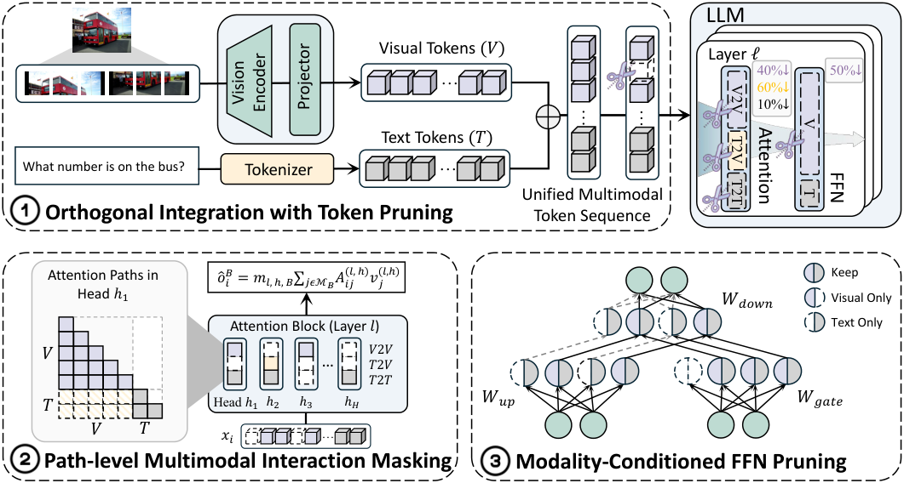

<h1 align="center">
<span>MWOP: Modality-aware Width-wise Operation Pruning</span><br>
<span>for Efficient MLLMs</span>
</h1>

<div align="center">

[](https://arxiv.org/abs/2610.01434)
[](LICENSE.txt)
[](https://github.com/EIT-NLP/MWOP)

</div>

> <strong>MWOP: Modality-aware Width-wise Operation Pruning for Efficient MLLMs</strong>
>
> Xudong Wang<sup>\*,1</sup>, Hao Wu<sup>\*,1,2</sup>, Haozhe Hu<sup>1,2</sup>, Peiran Yin<sup>1,2</sup>, Xinghao Chen<sup>1,3</sup>, Yunpu Ma<sup>4</sup>, Wei Zhang<sup>1</sup>, Xiaoyu Shen<sup>†,1</sup>
>
> <sup>1</sup> EIT-NLP Lab, Eastern Institute of Technology, Ningbo
>
> <sup>2</sup> Shanghai Jiao Tong University · <sup>3</sup> Hong Kong Polytechnic University
>
> <sup>4</sup> Munich Center for Machine Learning, Ludwig Maximilian University of Munich
>
> <sup>\*</sup> Equal contribution. <sup>†</sup> Corresponding author.
>
> Contact: [haowu.83@sjtu.edu.cn](mailto:haowu.83@sjtu.edu.cn), [xyshen@eitech.edu.cn](mailto:xyshen@eitech.edu.cn)


<p align="center">
  
</p>

If you find this work useful for your research and applications, please consider citing:

```bibtex
@misc{wang2026mwopmodalityawarewidthwiseoperation,
      title={MWOP: Modality-aware Width-wise Operation Pruning for Efficient MLLMs}, 
      author={Xudong Wang and Hao Wu and Haozhe Hu and Peiran Yin and Xinghao Chen and Yunpu Ma and Wei Zhang and Xiaoyu Shen},
      year={2026},
      eprint={2610.01434},
      archivePrefix={arXiv},
      primaryClass={cs.CV},
      url={https://arxiv.org/abs/2610.01434}, 
}
```

## 🔥 News <a id="news"></a>

- [TODO] Checkpoints are being prepared and will be released soon. 
- **[2026.10.03]** The code is now published!
- **[2026.10.01]** The preprint is now published!

## 💡 Highlights <a id="highlights"></a>

- **Modality-aware Width-wise Operation Pruning:** Independently prune attention paths (V2V, T2V, T2T) and visual FFN channels while retaining text FFN computation.
- **Cross-category Importance Estimation:** Estimates Taylor importance across General, Reasoning, OCR, and Grounding benchmarks to guide pruning.
- **Compression-aware Post-Training:** Recovers performance through LoRA post-training using attention and FFN pruning masks determined offline and kept fixed throughout training.
- **Compatibility with Token Pruning**: Can be combined with token compression methods for further inference acceleration.
- **Practical GPU Acceleration:** Implements Triton kernels that skip pruned attention regions and packs retained visual FFN channels into compact weight matrices for faster decoder prefill.

Results for **OV-7B** from the [MWOP paper](https://arxiv.org/abs/2610.01434):

| Method | Decoder TFLOPs | Prefill latency (ms) | Speedup |
| --- | ---: | ---: | ---: |
| Dense OV-7B | 44.31 | 237.0 | 1.0× |
| MWOP | 25.17 | 152.1 | 1.6× |
| ZOO | 21.75 | 119.0 | 2.0× |
| MWOP + ZOO | 12.37 | 81.2 | 2.9× |
| PyramidDrop | 21.96 | 124.9 | 1.9× |
| MWOP + PyramidDrop | 13.65 | 88.2 | 2.7× |

MWOP retains **99.7% average task performance** and **56.8% of dense decoder FLOPs** on OV-7B. Latency measures fixed-shape decoder prefill on an NVIDIA A100 40GB, excluding the vision encoder, projector, and online token selection. The logical unpadded estimate is **25.1237 TFLOPs**; packing each retained FFN width to 64 yields **25.1724 TFLOPs**. This accounts numerically for the table's 25.17 but does not establish its historical packing setting. Logical and packed costs are reported separately for all methods. See [acceleration details](acceleration/README.md) for the calculation and timing scope.

## 📚 Contents <a id="contents"></a>

- [News](#news): Preprint announcements and project updates.
- [Highlights](#highlights): Method overview and OV-7B results.
- [Preparation](#preparation): Environment setup, model formats, and data preparation.
- [Usage](#usage): Frozen masks, recovery training, evaluation, and decoder acceleration.
- [License](#license): MWOP licensing and retained upstream terms.
- [Acknowledgments](#acknowledgments): Upstream implementations and contributors.
- [Contact](#contact): Questions and collaboration.
- [Related Projects](#projects): Other projects from EIT-NLP.

### Repository structure

| Directory | Function | Guide |
| --- | --- | --- |
| `LLaVA-NeXT/` | Native OV model, Taylor search, pruning masks, LoRA, merging, inference | [Training and pruning](LLaVA-NeXT/README.md) |
| `lmms-eval/` | OV adapter, image/multi-image/video tasks and metrics | [Evaluation](lmms-eval/README.md) |
| `acceleration/` | OV decoder kernels, structured FFN execution, serial timing, theoretical FLOPs | [Acceleration](acceleration/README.md) |
| `assets/` | Method illustration from the paper source | |
| `scripts/` | Installation, training, evaluation, Taylor calibration, and speed testing | [Usage](#usage) |
| `pyproject.toml` | Native OV package and environment dependencies | [Preparation](#preparation) |

Keep the three code directories as siblings.

## 🔧 Preparation <a id="preparation"></a>

1. **Clone the repository.**

```bash
git clone https://github.com/EIT-NLP/MWOP.git
cd MWOP
```

Use Linux x86_64 with an NVIDIA CUDA GPU. Training also requires GCC/G++ and a CUDA toolkit for DeepSpeed's optimizer extension; make `nvcc` available or set `CUDA_HOME` to the toolkit directory (CUDA 12.8 for the pinned Torch build). Model weights, datasets, checkpoints, and experiment logs are not included.

| Workflow | Base model format | Environment |
| --- | --- | --- |
| Taylor search / LoRA / inference / evaluation | [Native OV-7B](https://huggingface.co/lmms-lab/llava-onevision-qwen2-7b-ov), `LlavaQwenForCausalLM` with `model_type=llava` in the original checkpoint or `llava_qwen` in local exports | Pinned legacy Transformers commit via the installation script |
| Decoder acceleration | [HF OV-7B](https://huggingface.co/llava-hf/llava-onevision-qwen2-7b-ov-hf), `model_type=llava_onevision` | Separate recent Transformers/Triton environment |

OV uses a Qwen2 language backbone: `llava_qwen`, Qwen2 configuration/modeling files, the OV conversation template, and the SwiGLU `gate_proj` projection are required architecture components.

2. **Configure paths once.** Run from the repository root:

```bash
cp scripts/config.example.sh scripts/config.sh
# Edit scripts/config.sh: set TRAIN_JSONL and IMAGE_FOLDER.
# Set CONDA_ROOT if Conda is not available on PATH.
```

The five entry scripts read this file automatically. Training, Taylor calibration, and evaluation activate the native environment; speed testing activates its separate acceleration environment. Environment variables supplied before a command override the example's defaults. Paths may be absolute or relative to the repository root. Keep `scripts/config.sh`, downloaded models, caches, and outputs out of your Git commits. To use another configuration file, set `MWOP_CONFIG=/path/to/config.sh`.

3. **Install the native training/evaluation environment.**

```bash
bash scripts/01_install.sh
```

The installer creates or reuses `mwop-ov` with Python 3.10, installs CUDA 12.8 PyTorch wheels and `pyproject.toml`'s `train,eval` extras, and checks runtime imports and package dependencies. It uses the pinned Transformers source commit required by the native OV implementation. Native scripts use SDPA/eager; FlashAttention is optional (`INSTALL_FLASH_ATTN=1 bash scripts/01_install.sh`) and requires a working CUDA build toolchain.

The native environment (Python 3.10.20, PyTorch 2.7.0+cu128) was freshly installed and checked with OV-7B on A100 40GB GPUs: two LoRA training steps, adapter export, CPU merge, and two samples on each of the 14 evaluation splits. These are execution checks, not a reproduction of the paper's accuracy. The dependency pins are not a complete Conda lock. Training, calibration, and evaluation require a CUDA GPU. Training also needs GCC/G++ and a CUDA toolkit for DeepSpeed's optimizer extension; installation itself does not require a GPU.

Decoder acceleration uses the independent [acceleration/pyproject.toml](acceleration/pyproject.toml) profile. A fresh Python 3.12.13 / PyTorch 2.11.0+cu130 environment, including public `einops==0.8.2` and compiled FlashAttention 2.8.3, passed installation checks, OV decoder numerical checks, and all three serial speed runs on A100. The speed trial used the supplied tile plan, 10 repetitions, and one timing sample; it verifies execution rather than the paper's latency numbers. The historical reference retains its original development version; see the [acceleration guide](acceleration/README.md) for installation.

4. **Prepare training data.** Point `TRAIN_JSONL` to your instruction data and `IMAGE_FOLDER` to its image directory. Each JSONL line uses the LLaVA conversation schema, for example:

```json
{"id":"example-1","image":"example.jpg","conversations":[{"from":"human","value":"<image>\nDescribe this image."},{"from":"gpt","value":"A description of the image."}]}
```

`example.jpg` must exist below `IMAGE_FOLDER`. The trainer also accepts `from=user/assistant`, an optional `from=system` turn, and `images` containing a list of image paths. Each turn must retain a string `value`; image paths may be absolute or relative to `IMAGE_FOLDER`. Instead of `TRAIN_JSONL`, you can set `DATA_PATH` to a YAML following [train.example.yaml](LLaVA-NeXT/ov_workflow/configs/train.example.yaml). Relative `json_path` entries inside that YAML are resolved against the YAML's directory. The training script checks the first 32 samples per dataset and writes an absolute-path YAML under `outputs/data/`.

On the first training or Taylor run, the scripts download the native OV checkpoint to `models/ov7b` if it is absent. SigLIP is read from the OV config and fetched through Hugging Face when loaded. For existing local weights, set `MODEL_NAME_OR_PATH` and optionally `VISION_TOWER` for training. Taylor and evaluation read the vision tower from the checkpoint's config. Set `DOWNLOAD_MODELS=0` for an already prepared offline setup, with SigLIP and datasets also present locally or cached. The default shared Hugging Face cache is `.cache/huggingface`; override `HF_HOME` if using a shared server cache. The benchmark YAMLs reference public datasets and download them when needed; datasets requiring access approval must be made available separately. See the [evaluation guide](lmms-eval/README.md) for local dataset configuration.

For local benchmark copies, set `LMMS_DATA_ROOT=/path/to/benchmarks`. The loader uses matching subdirectories such as `GQA`, `ai2d`, `VQAv2`, `ScienceQA`, and `RefCOCO`; missing local copies fall back to the public dataset IDs. This setting applies to evaluation and Taylor calibration. It is separate from the LoRA training images in `IMAGE_FOLDER`.

Recovery weights and the exact 282K training mixture are not distributed. The scripts accept your prepared training data; reproducing the paper's recovery result requires that mixture. Decoder acceleration additionally requires the separate HF-format OV checkpoint described below.

## 🎯 Usage <a id="usage"></a>

The five commands below are run from the repository root:

| Command | Action | Main output |
| --- | --- | --- |
| `bash scripts/01_install.sh` | Install native OV; `INSTALL_TARGET=speed` selects acceleration | Conda environment `mwop-ov` or `mwop-ov-speed` |
| `bash scripts/02_train.sh` | LoRA recovery with a joint mask | `outputs/ov_lora/` |
| `bash scripts/03_test.sh` | Merge LoRA and evaluate benchmark tasks | `outputs/ov_merged/`, `outputs/eval_14bench/` |
| `bash scripts/04_taylor.sh` | Attention and FFN Taylor calibration, rankings, and masks | `outputs/taylor/` |
| `bash scripts/05_speed.sh` | Serial OV decoder speed testing in the acceleration environment | `outputs/ov_speed/` |

Each entry supports `--help` and `--dry-run`. A dry run prints commands without installing packages, downloading weights, creating outputs, or launching GPU jobs. It does not validate runtime inputs or GPU availability.

### 1. Train and evaluate with the supplied frozen masks

```bash
bash scripts/02_train.sh
bash scripts/03_test.sh
```

Training automatically exports `outputs/masks/{path_mask,ffn_mask,joint_mask}.json`. These exact frozen masks prune V2V/T2V/T2T at **40% / 60% / 10%**, and **50% visual FFN / 0% text FFN** globally. They remove 265,216 visual FFN channels, including all 18,944 channels of zero-based layer 27. `HEAD_MASK_CONFIG` in the underlying trainer names a fixed mask input.

The defaults use one visible GPU with gradient accumulation to reach global batch 256. Set `NPROC_PER_NODE=8` for the paper's eight A100 40GB GPUs; GPU count times per-device batch must divide the global batch. The paper uses one epoch on a 282K instruction mixture, LoRA rank 128, alpha 256, dropout 0.05, learning rate 1e-5, a 3% warmup, and cosine decay. One-GPU feasibility depends on GPU memory and image/token length; the default configuration is not a guarantee that it fits smaller GPUs.

Training resumes complete checkpoints already present in `OUTPUT_DIR`; use a new output directory for an independent run or a different mask/data configuration. `03_test.sh` first merges the completed adapter export on CPU and copies its training mask into `ov_merged/ablation_config.json`. Reserve enough host RAM for the 7B model and adapter (approximately 32 GB or more) and disk space for the merged weights. It reuses a completed merge only when its adapter/config fingerprint matches. After changing the adapter, set `MERGED_DIR` to a new directory to avoid overwriting an older model. Keep base weights unchanged when reusing a merge. Evaluation errors return a nonzero exit status.

For a short end-to-end trial, use a separate output directory:

```bash
NPROC_PER_NODE=1 PER_DEVICE_TRAIN_BATCH_SIZE=1 TARGET_GLOBAL_BATCH=1 \
  MAX_STEPS=2 OUTPUT_DIR=outputs/ov_lora_smoke bash scripts/02_train.sh
OUTPUT_DIR=outputs/ov_lora_smoke MERGED_DIR=outputs/ov_merged_smoke \
  EVAL_TASKS=gqa EVAL_LIMIT=2 EVAL_OUTPUT=outputs/eval_smoke bash scripts/03_test.sh
```

This trial checks execution, not recovered model quality. To evaluate existing dense or merged native weights without merging:

```bash
EVAL_MODEL=/path/to/native-ov7b EVAL_TASKS=gqa EVAL_LIMIT=2 bash scripts/03_test.sh
```

### 2. Compute new Taylor importance and train with it

```bash
bash scripts/04_taylor.sh
MASK_CONFIG=outputs/taylor/joint_mask.json OUTPUT_DIR=outputs/ov_lora_taylor bash scripts/02_train.sh
OUTPUT_DIR=outputs/ov_lora_taylor MERGED_DIR=outputs/ov_merged_taylor \
  EVAL_OUTPUT=outputs/eval_taylor bash scripts/03_test.sh
```

Taylor calibration collects attention importance from the original dense OV model, aggregates four benchmark categories with Universal-Max, builds a path mask, then collects **structured FFN Taylor** scores under that path mask. It generates the FFN ranking and a joint attention/FFN mask. The default is 256 successful samples per split across all 14 splits; these datasets must be available, but your LoRA training data is not used in this step. `TAYLOR_SAMPLES=2 bash scripts/04_taylor.sh` is a small execution trial, not a reliable importance estimate. Use a distinct `TAYLOR_OUTPUT` when changing the checkpoint, seed, sample count, or pruning settings.

The two-sample trial completed all 14 attention and FFN collectors, category rankings, and joint-mask export on A100 GPUs. The resulting mask also completed two recovery-training steps, adapter merging, and a two-sample AI2D evaluation. Sampling shuffles dataset indices and loads selected images on demand instead of decoding every image into memory.

New-score allocation excludes layers with invalid all-zero FFN statistics by default. With only layer 27 excluded, ratio 0.5 removes 255,744 channels (48.2143% of the full FFN), rather than the frozen mask's 265,216. New scores do not reproduce the frozen channel indices. The advanced explicit L27-first option is described in the [training/pruning guide](LLaVA-NeXT/README.md); zero Taylor statistics alone do not demonstrate redundancy.

### 3. Evaluation and inference details

The default evaluation runs 14 splits representing the paper's 12 benchmarks:

| Category | Benchmarks |
| --- | --- |
| General | GQA, VQAv2, OK-VQA |
| Reasoning | ScienceQA-IMG, AI2D, MMStar |
| OCR | TextVQA, DocVQA, OCRBench |
| Grounding | RefCOCO, RefCOCO+, RefCOCOg |

RefCOCO and RefCOCO+ each run testA and testB. Additional task commands are in the [evaluation guide](lmms-eval/README.md). Native modality masking requires batch size 1 and one contiguous visual region. Adjacent image spans are supported; image–text–image inputs raise an error when modality masks are active. Dense inference retains its normal multi-image behavior.

For a single image, activate the native environment and run:

```bash
conda activate mwop-ov
python LLaVA-NeXT/ov_workflow/infer.py \
  --model outputs/ov_merged --image /path/to/image.jpg --prompt "Describe this image."
```

Inference and evaluation automatically load the model directory's `ablation_config.json`; retain it with the merged model.

### 4. Benchmark OV decoder acceleration

Install the separate acceleration environment, then set `SPEED_ENV_NAME` (default `mwop-ov-speed`) or `SPEED_VENV_PATH` in `scripts/config.sh`. `INSTALL_CUDA_TOOLKIT=1` supplies NVIDIA's CUDA 13 compiler wheels for FlashAttention; GCC/G++ must be available. With a matching system toolkit, omit that option and set `CUDA_HOME`. See the [acceleration guide](acceleration/README.md).

```bash
INSTALL_TARGET=speed INSTALL_CUDA_TOOLKIT=1 bash scripts/01_install.sh
bash scripts/05_speed.sh
# Smaller timing trial, using a fresh output directory:
SPEED_REP=10 SPEED_SAMPLES=1 SPEED_OUTPUT=outputs/ov_speed_smoke bash scripts/05_speed.sh
```

The script checks CUDA, acceleration imports, and the HF OV-7B model configuration. It downloads missing HF weights to `models/hf_ov7b` by default; set `SPEED_MODEL` to an existing local HF OV checkpoint and `DOWNLOAD_MODELS=0` to disable downloads. Use a fresh `SPEED_OUTPUT` for each experiment.

`SPEED_ALIGNMENT=64` is the default: retained FFN widths are zero-padded to multiples of 64 for efficient matrix multiplication, preserving the pruning mask. Set it to 1 for exact-width packing, which can be slower despite slightly fewer FLOPs. `SPEED_TILES` defaults to the supplied validated attention tile plan. `SPEED_REP` and `SPEED_SAMPLES` control timing repetitions and samples. The default run measures Dense/MWOP, MWOP + PyramidDrop, and MWOP + ZOO serially, producing `REPORT.md`, `summary.json`, and per-method measurement files under `outputs/ov_speed/`, plus `theory_logical.json` and `theory_packed.json` for the configured alignment. A failed method stops the run. It uses synthetic embeddings and fixed token/channel schedules, with numerical checks against the corresponding reference. Online token scoring and sorting are outside the timing scope.

Native merged checkpoints cannot be passed directly to this HF loader. A conversion/export tool and a recovered HF checkpoint are not included. The [acceleration guide](acceleration/README.md) describes software versions and measurement scope.

## 📄 License <a id="license"></a>

MWOP-specific contributions are licensed under the **Apache License 2.0**; see [LICENSE.txt](LICENSE.txt). Third-party code retains its original licenses and copyright notices. LLaVA-NeXT uses [Apache 2.0](LLaVA-NeXT/LICENSE); lmms-eval retains the [MIT license for its main pipeline and Apache 2.0 for its model/task code](lmms-eval/LICENSE).

## 🙏 Acknowledgments <a id="acknowledgments"></a>

This implementation builds on [LLaVA-NeXT](https://github.com/LLaVA-VL/LLaVA-NeXT), [lmms-eval](https://github.com/EvolvingLMMs-Lab/lmms-eval), [Transformers](https://github.com/huggingface/transformers), and the [PruningInferSim framework](https://github.com/EIT-NLP/LLM-Pruning/tree/main/PruningInferSim). We thank their authors and maintainers.

## ✉️ Contact <a id="contact"></a>

For questions, suggestions, or collaboration opportunities, please feel free to reach out:

- **Hao Wu:** [haowu.83@sjtu.edu.cn](mailto:haowu.83@sjtu.edu.cn)
- **Xiaoyu Shen:** [xyshen@eitech.edu.cn](mailto:xyshen@eitech.edu.cn)

## 🌐 Related Projects <a id="projects"></a>
- Survey
  - [Awesome-MLLM-Compression] [From Data to Model: A Survey of the Compression Lifecycle in MLLMs](https://github.com/EIT-NLP/Awesome-MLLM-Compression)
- Vision Encoder
  - [CVPR 2026] [UTPTrack: Towards Simple and Unified Token Pruning for Visual Trackingrack](https://github.com/EIT-NLP/UTPTrack)

- ImageLLM
  - [EMNLP 2025] [VisiPruner: Decoding Discontinuous Cross-Modal Dynamics for Efficient Multimodal LLMs](https://github.com/EIT-NLP/VisiPruner)
  - [ICLR 2026] [HiDrop: Hierarchical Vision Token Reduction in MLLMs via Late Injection, Concave Pyramid Pruning, and Early Exit](https://github.com/EIT-NLP/HiDrop)
  - [Preprint] [ViCA: Efficient Multimodal LLMs with Vision-Only Cross-Attention
](https://github.com/EIT-NLP/ViCA)